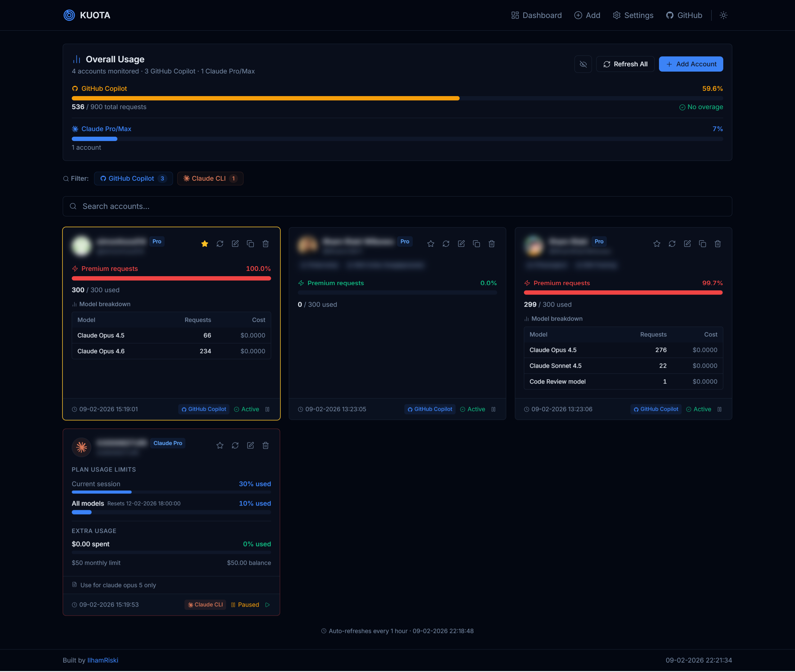

# KUOTA

Monitor GitHub Copilot and Claude Code usage across multiple accounts.

Built with [Bun](https://bun.sh), [Hono](https://hono.dev), [HTMX](https://htmx.org), and [Tailwind CSS](https://tailwindcss.com).



## Features

- **Multi-account** - monitor multiple GitHub Copilot and Claude Code accounts in one dashboard
- **GitHub Copilot** - track completions usage, chat conversations, total requests, and premium request consumption
- **Claude Code** - monitor API usage, total cost, budget limits, active sessions, and token consumption
- **Claude Pro/Max** - track daily message limits and weekly usage caps via Claude Code CLI OAuth credentials (auto-refresh supported)
- **Auto-refresh** - usage data automatically refreshed every hour in the background
- **MySQL backup** - optional sync from local SQLite database to remote MySQL server
- **PWA Ready** - install as a standalone progressive web app on any device

## Requirements

- [Bun](https://bun.sh) v1.0+
- For GitHub Copilot: a [Personal Access Token](https://github.com/settings/tokens) (Classic or Fine-grained with **Plan: Read** permission)
- For Claude Code: an [Anthropic Admin API Key](https://console.anthropic.com/)
- For Claude Pro/Max: [Claude Code CLI](https://docs.anthropic.com/en/docs/claude-code) logged in (`claude` command), or a manual OAuth access/refresh token pair

## Quick Start

```bash
# Clone the repo
git clone https://github.com/IlhamriSKY/KUOTA.git
cd KUOTA

# Install dependencies
bun install

# Copy and configure environment
cp .env.example .env

# Start the server
bun run start
```

Open [http://localhost:3000](http://localhost:3000) and add your accounts.

## Scripts

| Command               | Description                              |
| --------------------- | ---------------------------------------- |
| `bun run start`       | Build all + start production server      |
| `bun run dev`         | Fast build + start with hot reload (no icon rebuild) |
| `bun run build`       | Build all assets (CSS + icons + vendor)  |
| `bun run build:dev`   | Build for development (CSS + vendor only) |
| `bun run build:css`   | Build Tailwind CSS (minified)            |
| `bun run build:icons` | Generate PWA icons from SVG              |
| `bun run build:css:watch` | Watch mode for Tailwind CSS          |
| `bun run db:generate` | Generate Drizzle migration from schema   |
| `bun run db:push`     | Push schema directly to DB (dev)         |
| `bun run db:studio`   | Open Drizzle Studio (DB browser)         |

## Adding Accounts

### GitHub Copilot

#### Classic PAT
1. Go to [github.com/settings/tokens](https://github.com/settings/tokens/new)
2. No special scopes needed
3. Copy the token and paste it in the app

#### Fine-grained PAT
1. Go to [github.com/settings/personal-access-tokens/new](https://github.com/settings/personal-access-tokens/new)
2. Set **Account permissions > Plan > Read-only**
3. Copy the token and paste it in the app

### Claude Code
1. Go to the [Anthropic Console](https://console.anthropic.com/)
2. Create an **Admin API Key**
3. Paste the key in the app under the **Claude Code** tab

### Claude Pro/Max

Credentials are obtained from the **Claude Code CLI** OAuth session.

> [!CAUTION]
> **Disclaimer:** This feature uses an unofficial OAuth usage endpoint from Anthropic. The API may change or break at any time without notice.

#### Auto-detect (recommended)
1. Install [Claude Code CLI](https://docs.anthropic.com/en/docs/claude-code) and log in by running `claude` in your terminal
2. In the app, go to the **Claude Pro/Max** tab and check **"Auto-detect from CLI"**
3. The app reads `~/.claude/.credentials.json` automatically and handles token refresh

#### Manual token input
1. Locate `~/.claude/.credentials.json` on your machine
2. Copy `accessToken` and `refreshToken` from the `claudeAiOauth` object
3. Paste them in the app under the **Claude Pro/Max** tab

> [!WARNING]
> OAuth tokens expire and are refreshed automatically when a `refreshToken` is available. If the session expires, re-login with `claude` CLI. The usage API is unofficial and may change at any time.

## OAuth Setup (Optional)

For GitHub Device Flow login (no token copy-pasting):

1. Go to [github.com/settings/developers](https://github.com/settings/developers)
2. Click **"New OAuth App"**
3. App name: `KUOTA`
4. Homepage URL: `http://localhost:3000`
5. Callback URL: `http://localhost:3000`
6. Check **"Enable Device Flow"**
7. Copy the **Client ID** and set it in `.env` as `GITHUB_OAUTH_CLIENT_ID`

## Security

- PAT tokens and API keys are encrypted at rest using AES-256-GCM
- Encryption key is auto-generated and stored in `.secret` (gitignored)
- No tokens are sent to MySQL backup - only usage data
- All user input is HTML-escaped to prevent XSS
- SQL column names are whitelisted to prevent injection
- Security headers included (X-Content-Type-Options, X-Frame-Options, etc.)
- Rate limiting on mutation endpoints

## Note

> [!CAUTION]
> **This project is made for learning purposes. Use at your own risk.**
>
> Currently only supports GitHub Copilot, Claude Code, and Claude Pro/Max. Other AI agents will be available soon - or feel free to build your own and submit a PR!
